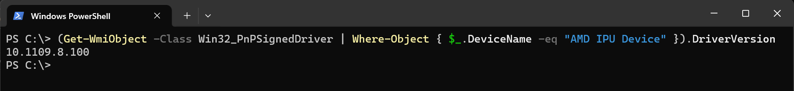
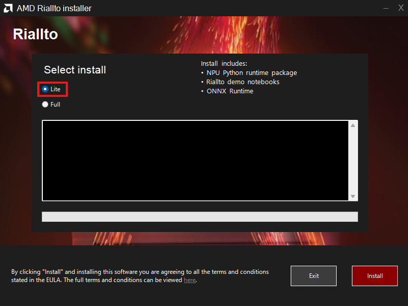

# Riallto

Riallto is an open source project that aims to bridge the gap between newcomers and performance ninjas in AMD's latest AI Engine technology. If you have a machine with an AMD processor with Ryzen AI, you have access to an NPU (Neural Processing Unit), a dedicated neural network accelerator.

The educational examples and software in this repository will enable you to interact with the NPU and learn how to write custom applications with this novel accelerator.

Note that NPUs can also be referred to as Inference Processing Units, or IPUs. You may see the NPU referred to as an "IPU" in some Ryzen AI documentation. On Windows once the Ryzen AI driver is installed on your computer, you will see a device named "IPU" in the Windows Device Manager."

## Quick Start (Windows)

The Riallto installer is separated into 'Lite' and 'Full' installation versions. The 'Lite' version has all the essential packages required for the Riallto and ONNX runtimes on the NPU to get started with prebuilt vision applications. The 'Full' version enables developers to write their own custom applications, which requires additional tools.

The steps below will allow you to get quickly started using the 'Lite' version of Riallto. For details on requirements and installation for the 'Full' version, follow the instructions in the [Install Riallto](https://riallto.ai/install-riallto.html) guide.

* [Download and unzip the the v10.1109.8.128 IPU driver](https://account.amd.com/en/forms/downloads/ryzen-ai-software-platform-xef.html?filename=ipu_stack_rel_silicon_prod_1.1.zip). You will need to create an AMD account if you do not have one.
* Open a Windows Command Prompt, or Powershell, as administrator.
* Change directory to the unzipped IPU driver directory, then run the `amd_install_kipudrv.bat` file. Press Enter if prompted.
* Confirm the IPU driver has installed correctly by running the following command in a Powershell terminal and checking the output matches that of the figure below:

```
(Get-WmiObject -Class Win32_PnPSignedDriver | Where-Object { $_.DeviceName -eq "AMD IPU Device" }).DriverVersion
```



* [Download and unzip the Riallto installer](https://www.xilinx.com/bin/public/openDownload?filename=Riallto-v1.0.zip). 
* Navigate to the `installer.exe` using the File Explorer and run as administrator, making sure the 'Lite' install option is selected when prompted, as shown in the figure below. 



Once the installation process has finished a Jupyter Lab session will open in your web browser, allowing you to start running the Riallto notebooks immediately. The notebooks can be opened by selecting them from the file browser pane on the left hand side of the Jupyter Lab session.

The installer places a shortcut on the desktop, which allows you to launch Riallto anytime after the installation process.

Note that the notebooks from sections 1, 2, 3, and 5 can be run using the 'Lite' install option. A 'Full' install is required to run the notebooks from section 4. See instructions in the [Install Riallto](https://riallto.ai/install-riallto.html) guide for more details.

## Quick Start (Linux)

Along with Windows support there is also support to install Riallto in Ubuntu 24.04 provided you upgrade to the 6.10 Linux Kernel. Steps for the installation process for this can be found [here](./scripts/linux).

## Contribute

Contributions to this repository are welcome. Please refer to [CONTRIBUTING.md](CONTRIBUTING.md) for how to improve Riallto.

## Support

For support, feel free to ask questions on the [GitHub discussions page](https://github.com/AMDResearch/Riallto/discussions).

## Licenses

[MIT License](LICENSE)

## Open Source Components

**License and Copyrights Info** [TAR/GZIP](https://www.xilinx.com/bin/public/openDownload?filename=riallto-v1.0-licenses.tar.gz)

**Open Components Source Code** [TAR/GZIP](https://www.xilinx.com/bin/public/openDownload?filename=riallto-v1.0-open_components.tar.gz)
