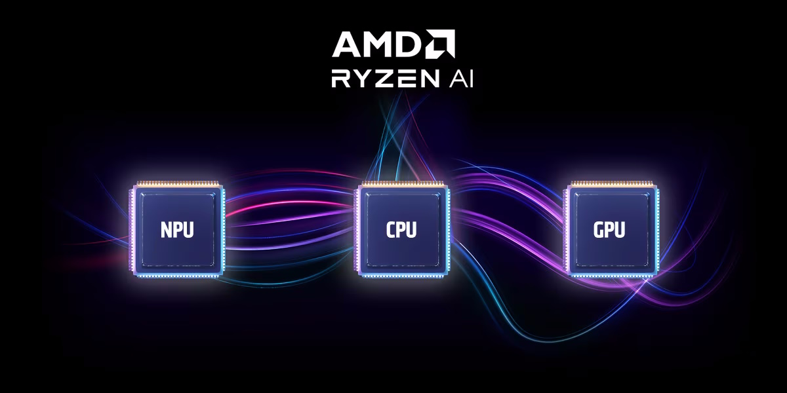

.. radical documentation master file, created by
   sphinx-quickstart on Fri Sep 29 10:03:15 2023.
   You can adapt this file completely to your liking, but it should at least
   contain the root `toctree` directive.

Welcome to Riallto - an exploration framework for the AMD Ryzen AI NPU
======================================================================

Introduction
------------

Riallto is an open-source exploration framework for first time users of the `AMD Ryzen AI Neural Processing Unit (NPU) <https://www.amd.com/en/products/ryzen-ai>`_ and is developed by teams from the AMD Research and Advanced Development group and the `AMD University Program <https://www.amd.com/en/corporate/university-program.html>`_. 

Riallto lets you explore the NPU architecture and the programming tools that are available for Ryzen AI. It includes an introductory video and a series of Jupyter notebooks. 

The accompanying Jupyter notebooks will guide you through Python examples showing how to program the NPU using vision processing and AI examples, and the steps of building your own application for the Ryzen AI.

View online or install Riallto
------------------------------

The notebooks can be viewed online, or you can :ref:`install-riallto` on your Ryzen AI laptop now to try out the notebooks for yourself.

Support
-------

For support, go to the `Riallto GitHub discussions forum <https://github.com/AMDResearch/Riallto/discussions>`_.

.. toctree::
   :hidden:

   Home<self>
   
.. toctree::
   :maxdepth: 1
   :hidden:
   :caption: Riallto overview

   Introduction<1_0_Introduction.nblink>
   install-riallto
   Riallto Video Overview<ryzenai_video_overview>
   Ryzen AI Features<1_1_ryzenai.nblink>
   Windows Studio Effects<2_1_MS_Windows_Studio_Effects.nblink>

.. toctree::
   :maxdepth: 2
   :hidden:
   :caption: NPU Architecture examples

   Loading your first example<3_1_Color_threshold_example.nblink>
   Understanding columns and tiles<3_2_Ryzenai_capabilities.nblink>
   Scaling applications to multiple compute tiles<3_3_Scaled_color_threshold_example.nblink>
   Optimizing data movement<3_4_Edge_detect_example.nblink>
   Multicasting and multiple kernels per tile<3_5_Color_detect_example.nblink>

.. toctree::
   :maxdepth: 2
   :hidden:
   :caption: Building applications

   Introduction to the Riallto software framework<4_1_software_framework.nblink>
   Write your first kernel<4_2_write_your_kernel.nblink>
   Using Run Time Parameters<4_3_kernels_with_runtime_parameters.nblink>
   How to use the vector processor<4_4_threshold_kernel_with_vector_ops.nblink>
   Describing an application<4_5_describe_an_application.nblink>
   Building a complete application<4_6_build_application.nblink>
   Using memory tiles<4_7_using_the_memtile_in_your_applications.nblink>
   Reusing software kernels<4_8_build_a_colorDetect_application.nblink>

.. toctree::
   :maxdepth: 2
   :hidden:
   :caption: Ryzen AI Machine Learning 

   Inference with PyTorch and ONNX<5_1_pytorch_onnx_inference.nblink>
   Re-training with PyTorch and ONNX<5_2_pytorch_onnx_re-train.nblink>

.. toctree::
   :maxdepth: 1
   :hidden:
   :caption: Python Package

   modules
   
.. toctree::
   :maxdepth: 1
   :hidden:
   :caption: Glossary

      
   Glossary<Glossary.nblink>
   
.. toctree::
   :maxdepth: 1
   :hidden:
   :caption: Appendix

   Review of Image Processing concepts<Appendix_Review_of_Image_Processing_Concepts.nblink>
   Install the NPU driver<prerequisites-driver>
   Get an AIE license<prerequisites-aie-license>
   Enable WSL<prerequisites-wsl>

