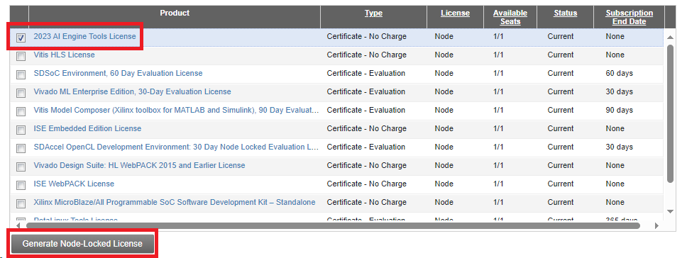
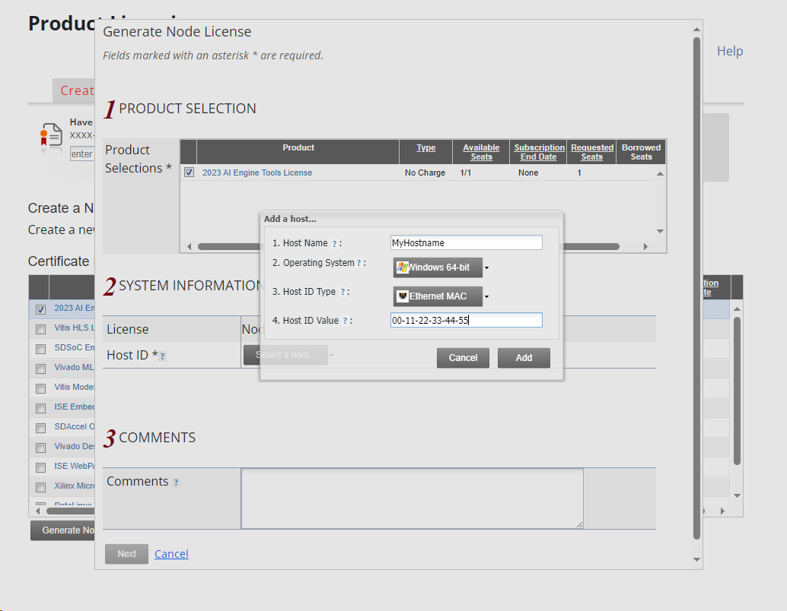
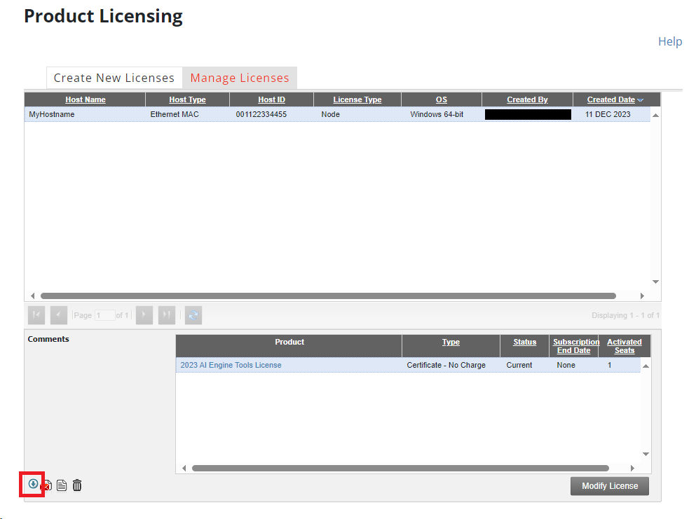

.. _prerequisites-aie-license:

AIE Build License
=================

To run any of the build time examples, you will need an AIE build license. Execute these instructions after the 'Full' install has completed.

You will require your network adapters MAC address on Linux and the WSL instance MAC address on Windows in order to apply for a AIE build license. 

On Windows you can get your WSL MAC address by running the following command in Powershell:

.. code-block:: console

    wsl -d Riallto ip -brief link show eth0

On Ubuntu you can get your MAC address by running the following command in your terminal, and selecting your appropriate network interface:

.. code-block:: console

    ip -brief link show 

Next, go to the `AMD Product Licensing page <https://www.xilinx.com/getlicense>`_ and generate a node locked license for AI Engine tools. You will need to create an AMD account if you do not have one.

Select '2023 AI Engine Tools License' from the menu then press the 'Generate Node-Locked License' button.

Press the 'Select a host' option and enter your computer hostname and WSL Ethernet MAC address you obtained earlier.

Once your license has been generated, select the license from the 'Manage Licenses' tab and press the download button on the bottom left of the screen, as highlighted in the figure below, saving the file to a known directory.

Use the setup_license.ps1 script, found within the Riallto installer zip file, to add the license to the WSL config using the following command within Powershell. Make sure to replace '<path-to-license-file>' to where you saved your license file.

.. code-block:: console

    powershell -ExecutionPolicy Bypass -File <path-to-riallto-installer>\scripts\utils\setup_license.ps1 <path-to-license-file\Xilinx.lic>
