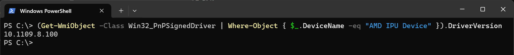

.. _prerequisites-driver:

IPU Driver
==========

The latest release of Riallto (v1.0) only supports the IPU driver version 10.1009.8.100. You can download the driver from the `Ryzen AI Software Platform page <https://account.amd.com/en/forms/downloads/ryzen-ai-software-platform-xef.html?filename=ipu_stack_rel_silicon_1.0.zip>`_. You will need to register an AMD account to access this page. 

Installation
------------

1. Unzip the downloaded zipfile.
2. Open a Powershell terminal **as administrator**. Then change into the extracted directory and run the .bat file:
   ``.\amd_install_kipudrv.bat``

If successful, you should be able to confirm the IPU version by running the following command in a Powershell terminal and checking the output matches that of the figure shown below.

.. code-block:: console

   (Get-WmiObject -Class Win32_PnPSignedDriver | Where-Object { $_.DeviceName -eq "AMD IPU Device" }).DriverVersion

Refer to the `Ryzen AI docs <https://ryzenai.docs.amd.com/en/latest/inst.html>`_ for more detailed information on the driver and setup.