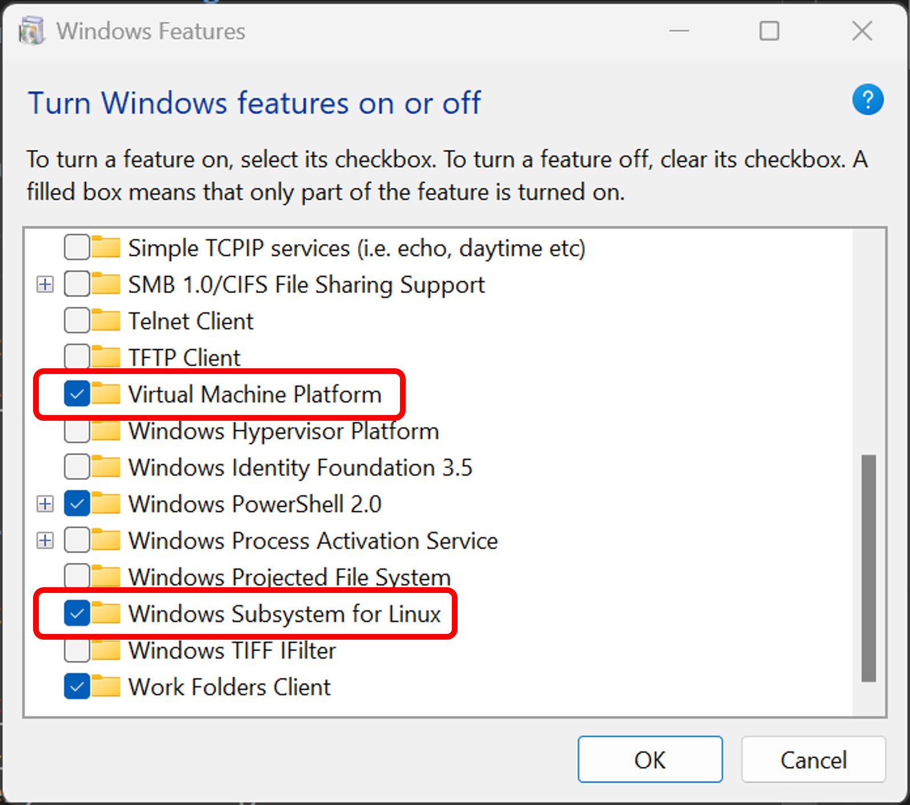
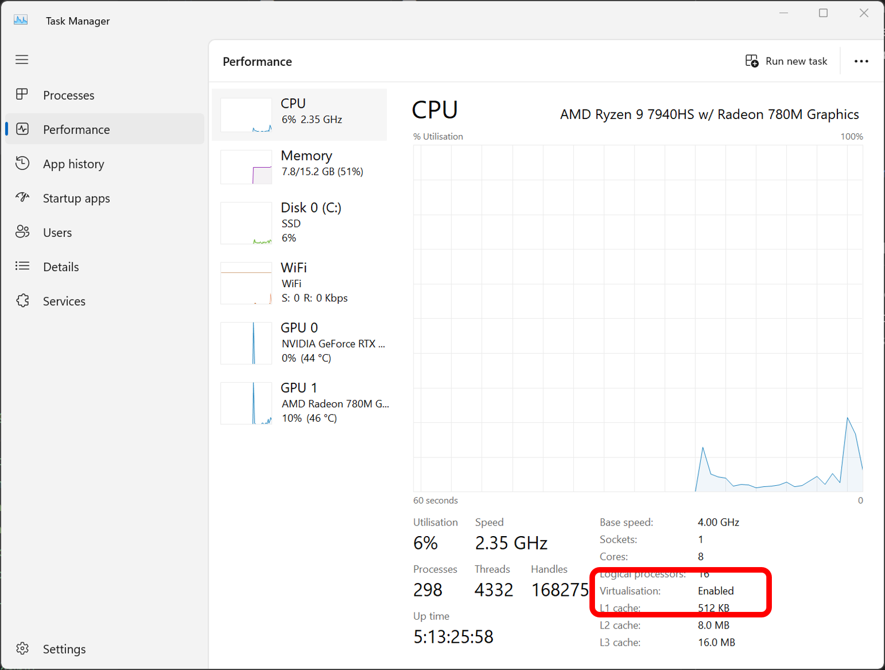

.. _prerequisites-wsl:

Install WSL
===========

Riallto relies on WSL in order to install the necessary application building developer tools.

WSL Requirements
----------------

For WSL to function the following windows features need to be enabled:

- Virtual Machine Platform
- Windows Subsystem for Linux
- Virtualization enabled (in BIOS/UEFI)

On Windows 11 platforms, simply running the following command in a powershell terminal, as per `official Microsoft instructions <https://learn.microsoft.com/en-us/windows/wsl/install>`_, will enable the correct features and setup WSL for you.

.. code-block:: shell

    wsl --install

**We have noticed this has not been the case on every machine, so the following are manual sets and checks you should do if the command above did not work.**

Enabling WSL Windows features
-----------------------------

Click the windows start button and search for **"turn windows features on or off"**. Make sure, **Virtual Machine Platform** and **Windows Subsystem for Linux** are selected. As follows:

If these features were not previously select, you may have to reboot your machine after enabling them.

Refer to `Microsoft's manual instructions for enabling WSL features <https://learn.microsoft.com/en-us/windows/wsl/install-manual>`_ for more detail.

Enabling virtualization
-----------------------

You can check if virtualization is enabled in the Windows Task Manager's performance tab. In Task Manager, select CPU and check for "virtualization: **enabled**".

Refer to this `Microsoft guide <https://support.microsoft.com/en-us/windows/enable-virtualization-on-windows-11-pcs-c5578302-6e43-4b4b-a449-8ced115f58e1>`_ on enabling virtualization with various manufacturer devices.
